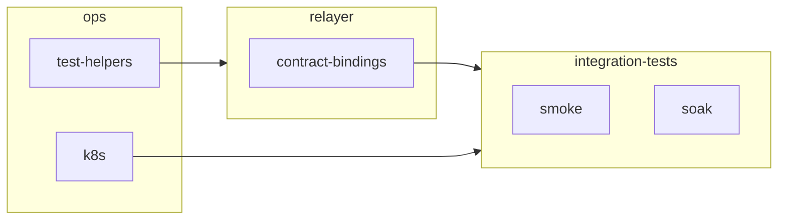

# Getting Started

## Local setup

```bash
make install
```

## Go Modules Dependency


```mermaid
flowchart LR
  subgraph ops
  test-helpers
  k8s
  end

  subgraph relayer
  contract-bindings
  end

  subgraph integration-tests
  smoke
  soak
  end

  contract-bindings --> integration-tests
  test-helpers --> relayer
  k8s --> integration-tests
```
